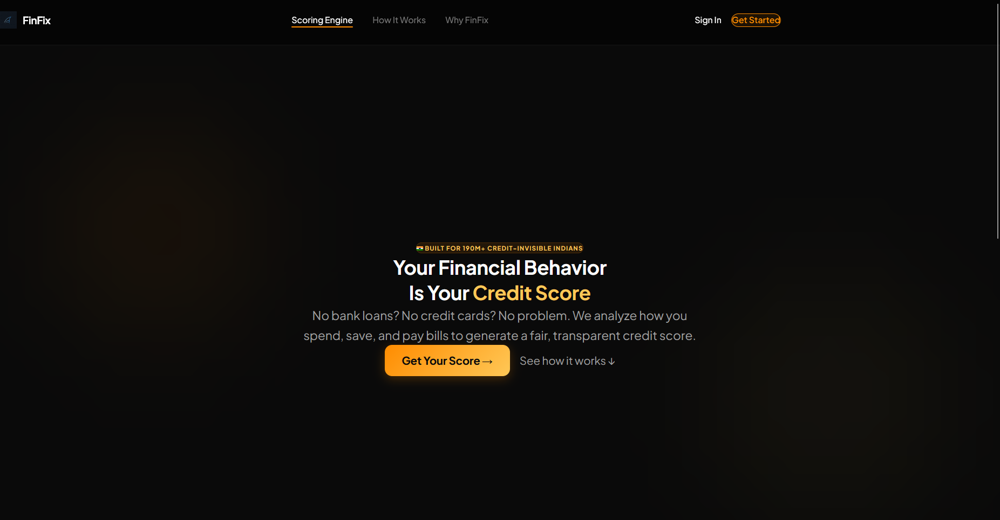
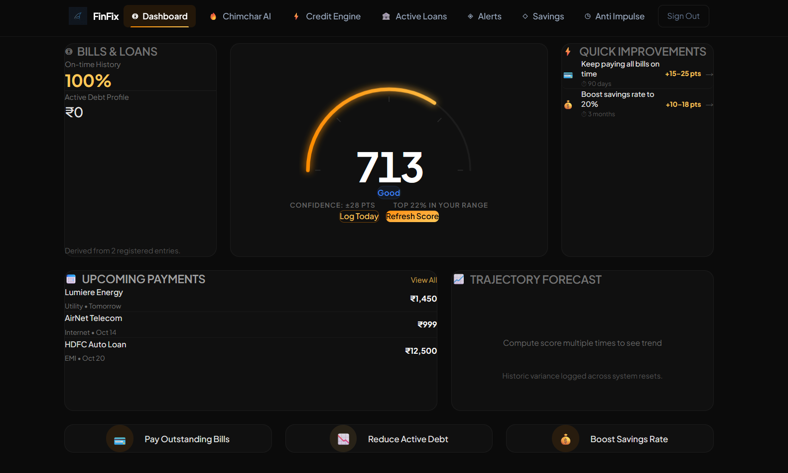

<div align="center">

```
 ███████╗██╗███╗   ██╗███████╗██╗██╗  ██╗
 ██╔════╝██║████╗  ██║██╔════╝██║╚██╗██╔╝
 █████╗  ██║██╔██╗ ██║█████╗  ██║ ╚███╔╝ 
 ██╔══╝  ██║██║╚██╗██║██╔══╝  ██║ ██╔██╗ 
 ██║     ██║██║ ╚████║██║     ██║██╔╝ ██╗
 ╚═╝     ╚═╝╚═╝  ╚═══╝╚═╝     ╚═╝╚═╝  ╚═╝
```

**Smart finances. Stronger credit. Zero stress.**

</div>


---

## 🌐 Live Website

> 🏆 **Hackathon Juries — please view the full project here:**
>
> ### 👉 [https://finfix.strawhats.co.in](https://finfix.strawhats.co.in/)
>
> *The live deployment is the best way to experience FinFix. All features are fully functional — sign up, explore the dashboard, and interact with Chimchar AI.*

---

## 💡 What is FinFix?

FinFix is an AI-powered personal finance platform built for young Indians who want to **build credit responsibly**, **avoid impulse spending**, and **grow wealth safely** — without needing prior financial knowledge.

Unlike traditional budgeting apps, FinFix uses a proprietary **Credit Scoring Engine** that analyzes your daily financial behavior and gives you an actionable credit-readiness score — even before you have a formal credit history.

---

## ✨ Key Features

| Feature | Description |
|---------|-------------|
| **📊 Credit Score Dashboard** | Real-time credit-readiness score with a visual gauge, trend forecast, and personalized improvement tips |
| **🔥 Chimchar AI** | AI-powered financial assistant that guides you on liquid mutual funds and credit risk reduction (powered by Gemini) |
| **⚡ Credit Engine** | Deep-dive into the 5 factors that affect your score — payment consistency, savings, income stability, spending discipline, and debt-to-income |
| **🏦 Active Loans Tracker** | Add and manage all your loans with tenure tracking, progress bars, end-date calculations, and AI-powered repayment insights |
| **💰 Savings Planner** | Track savings goals and monitor your savings-to-income ratio |
| **🛡️ Anti-Impulse Timer** | Set cooling-off timers before making impulse purchases — get notified via email when the timer expires |
| **🔔 Smart Alerts** | Real-time email notifications for score changes, spending spikes, and timer completions |
| **👤 Profile & Onboarding** | One-time financial profile setup (salary, expenses, debts) stored securely in Supabase |

---

## 🏗️ Tech Stack

| Layer | Technology |
|-------|-----------|
| **Frontend** | React 19, Vite, Tailwind CSS, Framer Motion |
| **Backend** | FastAPI (Python), Uvicorn |
| **AI** | Google Gemini API (`gemini-2.5-flash-lite`) |
| **Database** | Supabase (PostgreSQL + Auth) |
| **Email** | Resend API |
| **Hosting** | Firebase Hosting (frontend) + Render (backend) |

---

## 🚀 Getting Started (Local Development)

```bash
# 1. Clone the repo
git clone <repo-url>
cd HackerzStreet

# 2. Backend setup
cd src/backend
pip install -r requirements.txt
# Create .env with SUPABASE_URL, SUPABASE_KEY, GEMINI_API_KEY, RESEND_API_KEY
uvicorn main:app --reload --port 8000

# 3. Frontend setup (new terminal)
cd src/frontend
npm install
# Create .env with VITE_SUPABASE_URL, VITE_SUPABASE_ANON_KEY, VITE_API_URL
npm run dev
```

---

## 🗂️ Project Structure

```
HackerzStreet/
├── src/
│   ├── frontend/           # React + Vite SPA
│   │   ├── src/
│   │   │   ├── features/   # Feature modules
│   │   │   │   ├── feature-ai/        # Chimchar AI assistant
│   │   │   │   ├── feature-auth/      # Auth & profile
│   │   │   │   ├── feature-dashboard/ # Dashboard, savings, alerts
│   │   │   │   ├── feature-loans/     # Active loans tracker
│   │   │   │   └── feature-scoring/   # Credit engine & chat
│   │   │   └── components/  # Shared UI components
│   │   └── dist/            # Production build
│   │
│   └── backend/             # FastAPI server
│       ├── main.py          # App entry point
│       ├── feature-scoring/ # Score computation, chat, loans
│       └── feature-mailing/ # Email service & templates
│
├── firebase.json            # Firebase Hosting config
├── render.yaml              # Render backend config
└── docs/                    # Project documentation
```



---

## 👥 Team Chim4

Built with ❤️ for **HackerzStreet 4.0**

---

*© 2026 Team Chim4. All rights reserved.*
